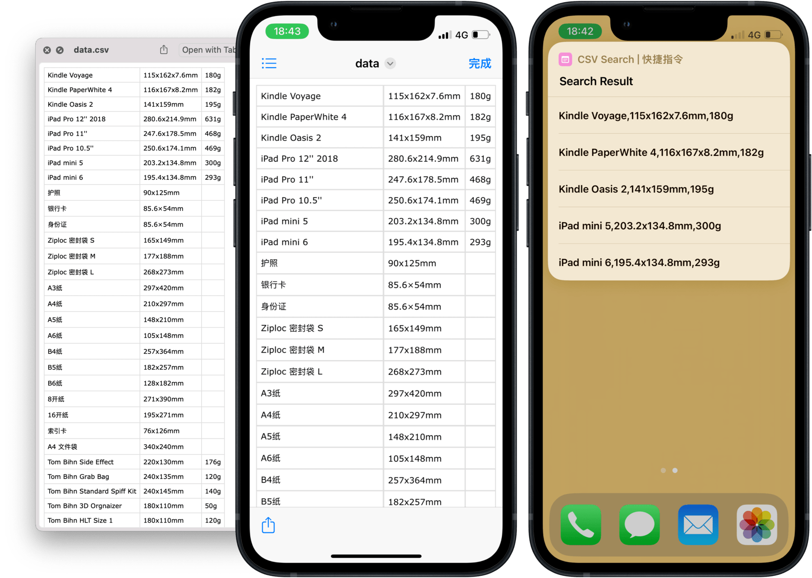

# CSV 数据录入与检索

保存和查询常用、零碎的数据。

- [录入动作下载](https://www.icloud.com/shortcuts/46de5dcff1c1423ebf514c95a2a51bc4)
- [检索动作下载](https://www.icloud.com/shortcuts/8d17586b5015408da42cb64710abbfd6)

出处：[《用 Shortcuts 配合 CSV，随手查询常用物品参数 - #Untag》](https://utgd.net/article/9514)。

