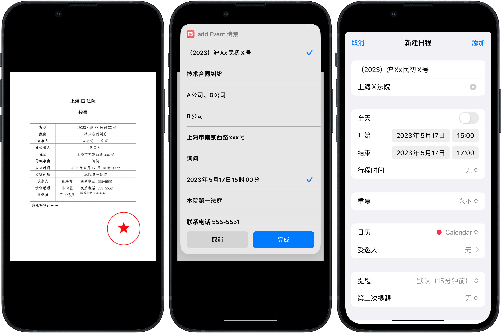

# Cal 从法院传票创建日历日程

[Shortcuts 动作下载](https://www.icloud.com/shortcuts/43593d94a23349139c10aca840cf3456)

对于老玩家而言，OCR 已如同空气一般自然，但对于新手而言，即便知道 Shortcuts 有个免费 OCR 模块，很可能也不知道如何使用，尤其是如何妥善处理 OCR 获得的数据。此处再提供一个真实案例，展示 OCR 技术在法律工作中的应用：将法院传票快速转换为日历日程。

出处：[《用 Shortcuts 将法院传票快速转换为日历日程》](https://utgd.net/)（发布时间未定）。

