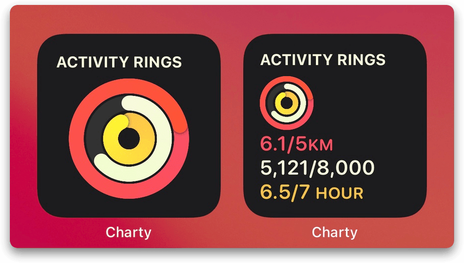

# Charty Rings 统计环

Apple Watch 的统计圆环，可以自定义任何数据，比如饮水量、咖啡因摄入或者财务状况。需配合 [Charty](https://chartyios.app) 使用。

- [Shortcuts 动作下载](https://www.icloud.com/shortcuts/72c69f16e0cc4bc5be4c0cb11a644249)
- [配色下载（URL Scheme）](charty://add-theme?name=Activity-Rings&colors=FEC24B,F9FADD,FC4E68)

出处：[《用 Shortcuts 和 Charty 制作 Apple Watch 风格的统计圆环 - #Untag》](https://utgd.net/article/8295)

