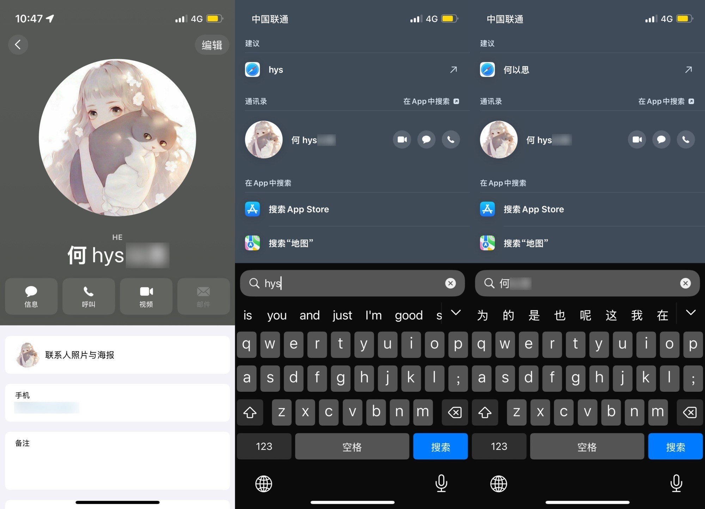

# Contacts 联系人免听写

[Shortcuts 动作下载](https://www.icloud.com/shortcuts/a9b506b0addf4f7cbaa430ab331136cc)

原生听写（语音输入）功能会尝试拟合你说的内容和联系人信息，导致在正常的文本中，可能随机出现一些联系人名字。[有人发现](https://www.reddit.com/r/ios/comments/1oftoml/a_7line_script_fixed_my_biggest_ios_annoyance_in/)，通过在联系人姓名中插入一些无法发音的字符，可以避免语音输入过拟合。

受前述方案启发，本方案尝试在中文环境下修改联系人信息，将联系人姓名的拼音首字母缩写标于名字前，既可避免语音输入出错，又不影响正常搜索全名，并且增加了通过首字母搜索联系人的新功能。

出处：《如何避免 iPhone 语音输入随机插入联系人姓名》（发布时间未定）。

