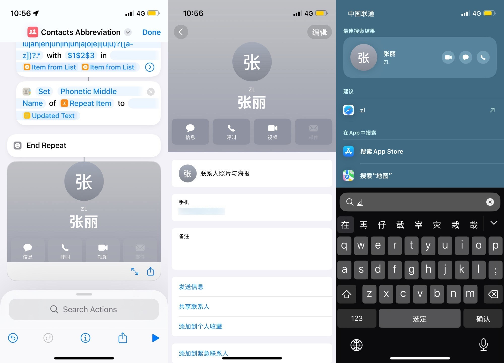

# Contacts 设置联系人首字母缩写

[Shortcuts 动作下载](https://www.icloud.com/shortcuts/5125f4fe4db94f439f6ee54883ed8f11)

中文环境中，不少人习惯通过姓名拼音首字母缩写查找联系人，但 iPhone 原生并不支持此功能（截至本文档编写之日 20251031）。

本方案可自动生成缩写并置于不影响日常使用的联系人信息字段中。默认将缩写添加至中间名的拼音字段，盖中文人名通常无中间名，此物可挪来一用，读者也可选用其他字段。

出处：《如何在 iPhone 上通过拼音首字母缩写搜索联系人》，发布时间未定。

