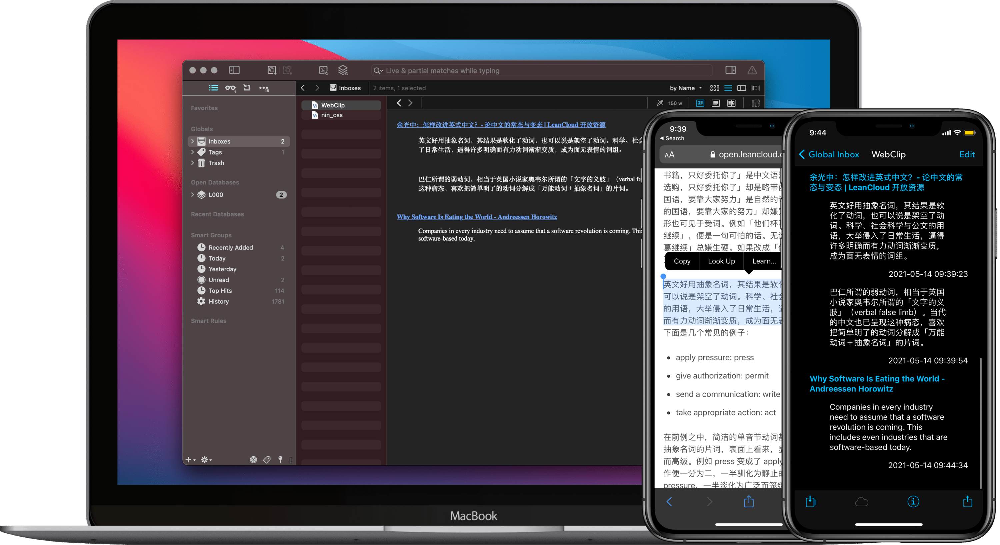

# DEVONthink Clip Web 网页摘抄

摘抄网页内容为 Markdown 格式。并保存到 DEVONthink，当然你也可以储存到其他位置，DEVONthink 只是选择之一，方便统一浏览、管理。

[Shortcuts 动作下载](https://www.icloud.com/shortcuts/09ee362361ff4259b776cf5a0e607ae5)

出处：[《用 DEVONthink 做网页摘抄，夺回数据所有权 - #Untag》](https://utgd.net/article/9167)。

