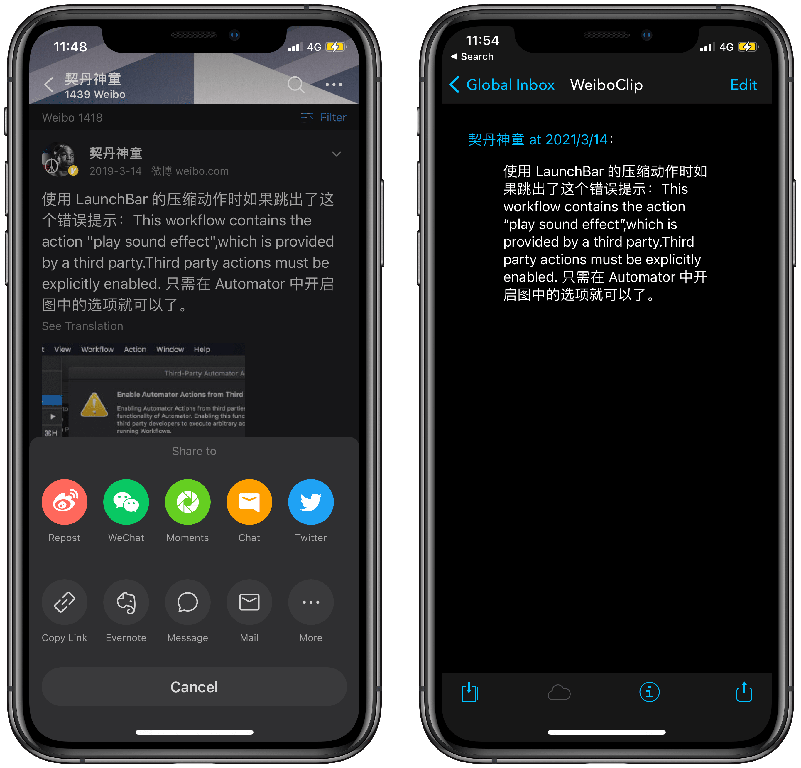

# DEVONthink Clip Weibo 微博摘抄

摘抄微博内容为 Markdown 格式。并保存到 DEVONthink，当然你也可以储存到其他位置，DEVONthink 只是选择之一，方便统一浏览、管理。

[Shortcuts 动作下载](https://www.icloud.com/shortcuts/e91cc8ef23be44669551e7e17668e860)

出处：[《用 Shortcuts 和 DEVONthink 摘抄微博内容 - #Untag》（预计春节前发布）](https://utgd.net/article/9690)。

