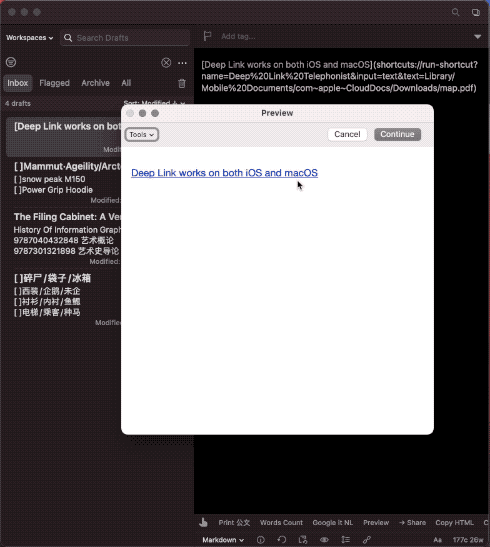

# 生成与打开 macOS 与 iOS 通用的文件链接

一个非常老的方案，留在此处作为信息公开。

生成文件链接，可同时用于 macOS 与 iOS。由于未纳入替身文件等机制，在原始文件移动或重命名后，链接将会失效（我没有太多时间使用 iOS 设备，而且痛恨 iCloud，继续研究没有回报）。

示例动作仅包括部分 iCloud 中的文件夹，请根据需求自行添加。

打开链接的动作中填写了我的电脑路径 `/Users/Min/`，请修改成你的（我不确定 Shortcuts 中的 Shell 能不能识别相对路径，也不想改动，因为根据目前 Shortcuts 的薛定谔状态，任何修改都会导致动作无缘无故失效）。

出处：《用 Shortcuts 制作 macOS&iOS 通用的文件链接》（发布时间未定）。

- [Shortcuts 动作下载：生成文件链接](https://www.icloud.com/shortcuts/c607429c39784002b51312ec85c847c7)
- [Shortcuts 动作下载：打开文件链接](https://www.icloud.com/shortcuts/c2073f15b990407eb533d19f05535b79)

