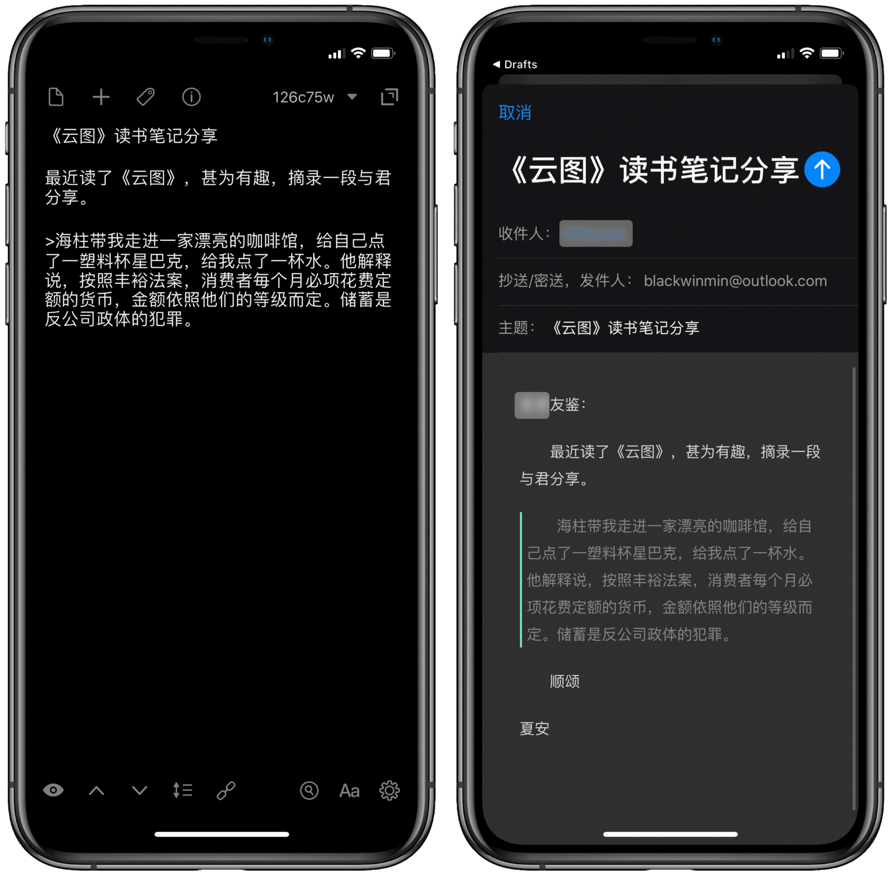

# Mail with Style 一键发送个性化邮件

一封电子邮件能反映出发件人的品性。

邮件格式、样式并无绝对的对错，甚至像“4 个空格当缩进”这种低年级做法，只要对方不在意，那也无伤大雅。但正如 Simon Garfield 在《字体故事》中所言，我们之所以整出那么多花样，其实都是为了表达自我。

即便在过去，发出一封不规范的邮件也是不礼貌的；如今在自动化工具的帮助下，过去需要一项一项检查的工作也变得简单，如果仍然不注重邮件礼仪，则实在说不过去。

- 原文：[《用 Shortcuts 一键发送个性化邮件》](https://utgd.net/)（发布时间暂定2023年9月）。
- [通用版 Shortcuts 动作下载](https://www.icloud.com/shortcuts/fffbd3f38aaf4be785b2131bc9837597)

Drafts 动作请复制段落下方 URL 到 Drafts 中后点击加载（需进入 Link Mode），浏览器很可能无法识别。Drafts 配套 Shortcuts 动作[点此下载](https://www.icloud.com/shortcuts/b6122dbe70ec41759d4891813540ea0e)。

```
drafts://action?data=%7B%22uuid%22:%22D9531B0E-C88D-4F25-900E-0766EE9932DF%22,%22steps%22:%5B%7B%22platforms%22:3,%22data%22:%7B%22waitForResponse%22:%22false%22,%22shortcutName%22:%22Mail%20with%20Style%22,%22template%22:%22%5B%5Bdraft%5D%5D%22,%22shortcutID%22:%22%22%7D,%22type%22:%22runShortcut%22,%22isEnabled%22:true,%22uuid%22:%22BBAF1210-4B55-4B9D-9AD2-8E9778572347%22%7D%5D,%22backingPlatforms%22:3,%22shortName%22:%22%22,%22shouldConfirm%22:false,%22disposition%22:3,%22keyCommand%22:%7B%22optionKey%22:false,%22input%22:%22%22,%22controlKey%22:false,%22commandKey%22:false,%22type%22:%22action%22,%22discoverabilityTitle%22:%22%E2%86%92%20Mail%20with%20css%22,%22shiftKey%22:false%7D,%22logLevel%22:2,%22groupDisposition%22:0,%22notificationType%22:2,%22tintColor%22:%22blue%22,%22actionDescription%22:%22%22,%22keyUseIcon%22:false,%22icon%22:%22action_email_filled%22,%22visibility%22:480,%22backingIsSeparator%22:false,%22groupUUID%22:%2222EFC22A-FD41-4148-9666-8BE5A96D3D0E%22,%22assignTags%22:%5B%5D,%22name%22:%22%E2%86%92%20Mail%20with%20css%22%7D
```

