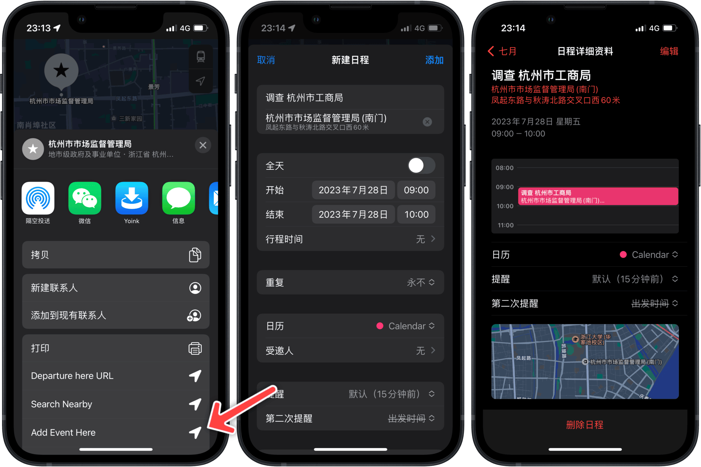

# Map Add Event Here 基于地点，快速创建日历日程

在确定目的地后，即可**就地创建日程**，减少重复工作和出错机率。使用方式如下：

1. 先在原生地图软件中确定日程的地点；
2. 用过分享菜单运行 Shortcuts 动作“Add Event Here”；
3. Shortcuts 会弹出日程创建页面，其中已经填好位置信息，但为确保人工智能——或者其他机制——不要自作主张穿凿附会，务必点一下，在相关地点中明确选中目的地；
4. 填写其他日程信息，并创建日程。

- 出处：[《基于地点，快速创建日历日程（iOS）》（付费）](https://utgd.net)（发布时间未定）
- [Shortcuts 动作下载链接](https://www.icloud.com/shortcuts/46e3fad75f4740a79da3534b237b2968)

