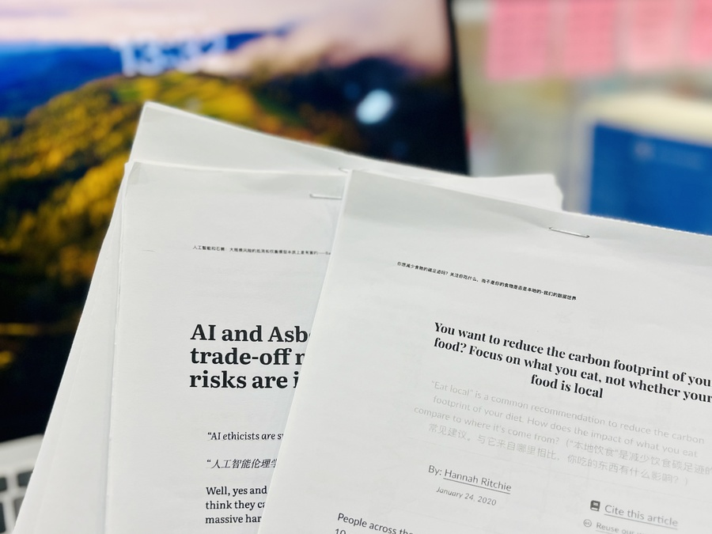

# PDF Booklet Single Page 单面打印小册子

将 PDF 页面顺序调整为适合单面打印的小册子形式，以充分利用废纸背面。调整后以每页纸张承载两页 PDF 的形式打印，批量裁开得到的纸质件后直接叠合，即可得到按页码顺序排布的文件，无需再手动调整顺序。

出处：[《活用废纸，把待读文章打印成便携小册子（附 Shortcuts）》](https://utgd.net/article/20876/)。

下载：[Shortcuts 动作](https://www.icloud.com/shortcuts/a2e8fb5b88464cd38a8d374b5cd3b523)。

