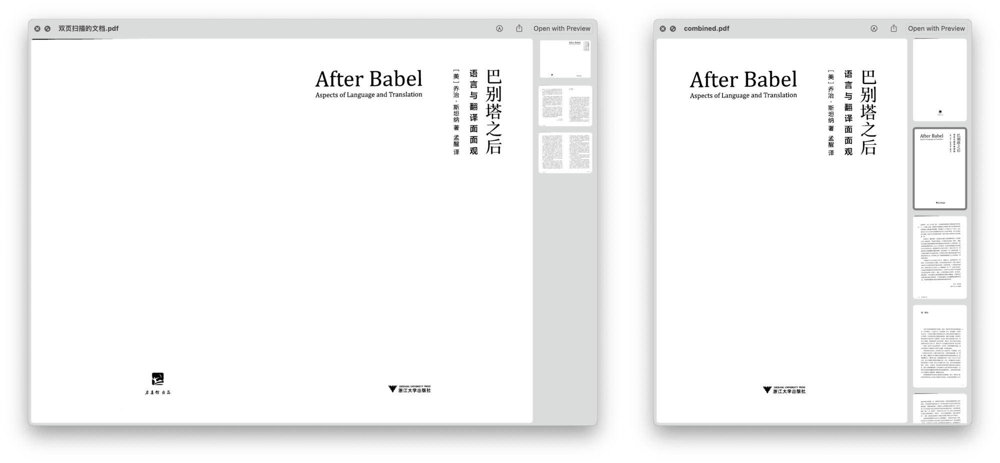

# PDF Cutter

将双页扫描的 PDF 切分为单页扫描的版本，方便阅读。

由于 Shortcuts 不能获取 Desktop 及其子文件夹中的任何文件，故放弃自带文件处理模块，全部用 Shell Script 实现。缺点是所用的 imagemagick 无法识别输入分辨率，因而输出 PDF 时也不能保持原有分辨率。

另外，如果垃圾桶中已有 temp 文件夹，会导致 `mv` 命令失效，请手动清空垃圾桶中已有的 temp 文件夹。虽然我可以在代码中解决这些细节问题，但用代码合并 PDF 本就是权宜之计，故我并无兴趣在这个本就不会长久的破罐子上修修补补。

[Shortcuts 动作下载](https://www.icloud.com/shortcuts/d585b0e81469432387be2fa2fb6abd4e)

另有 [Automator 版本](https://github.com/BlackwinMin/Automator-gallery/tree/master/PDF%20Cutter)。

