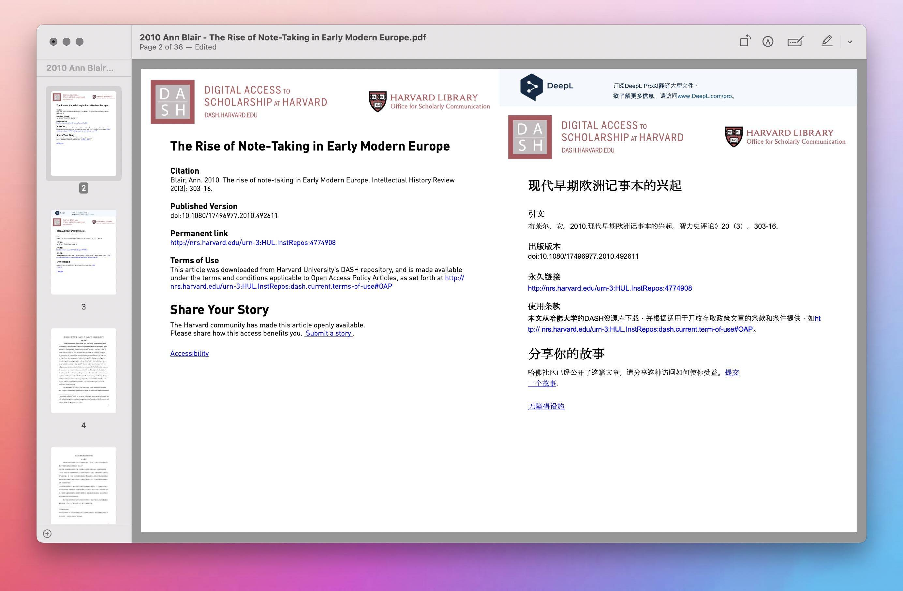

# PDF Interweave 用于制作双语对照翻译版 PDF

准备原文 PDF 和译文 PDF，随后运行 Shortcuts 并选取前述素材文件，即可生成一页原文、一页译文的双语对照翻译版 PDF，以便比对阅读。

为确保穿插时原文和译文互相对应，请保证两份 PDF 的页数一样。

部分阅读器——比如原生预览工具——会把 PDF 的第一页识别成封面，随后的页面才是双页显示，在这些阅读器里还要在开头加个空白页才能左右分列显示双语。

如您的素材是 Google 及其衍生服务提供的中文 PDF，在转换后文字层可能变成乱码（与 Shortcuts 关系不大）。

出处：[《制作一个“书虫”式的双语 PDF》](https://utgd.net/article/9583)

下载：[Shortcuts 动作](https://www.icloud.com/shortcuts/4d451fca072145f0bc737c406a28e73b)。

