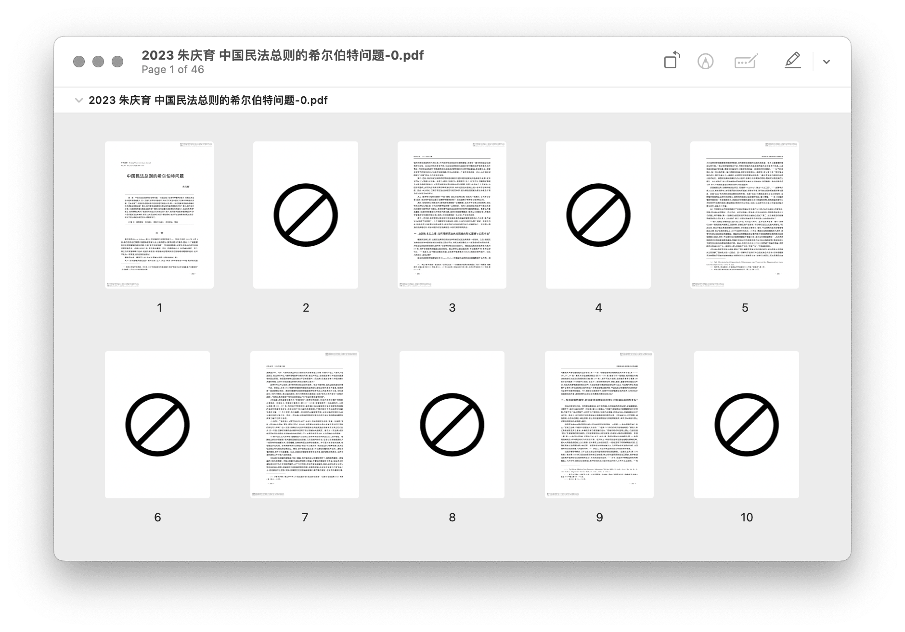

# PDF Mark Pages 标记废弃页面

摘要：循环利用废纸打印时，细心人会在作废页上打叉，以示此页作废。本动作可提前完成标记，节省人工。

出处：《用废纸打印时，提前划掉作废页面｜PDF Toolbox》（预计2024年1月末发布）

下载：[Shortcuts 动作](https://www.icloud.com/shortcuts/2ef876c99c5c45cf907ff932612c3d5f)。

