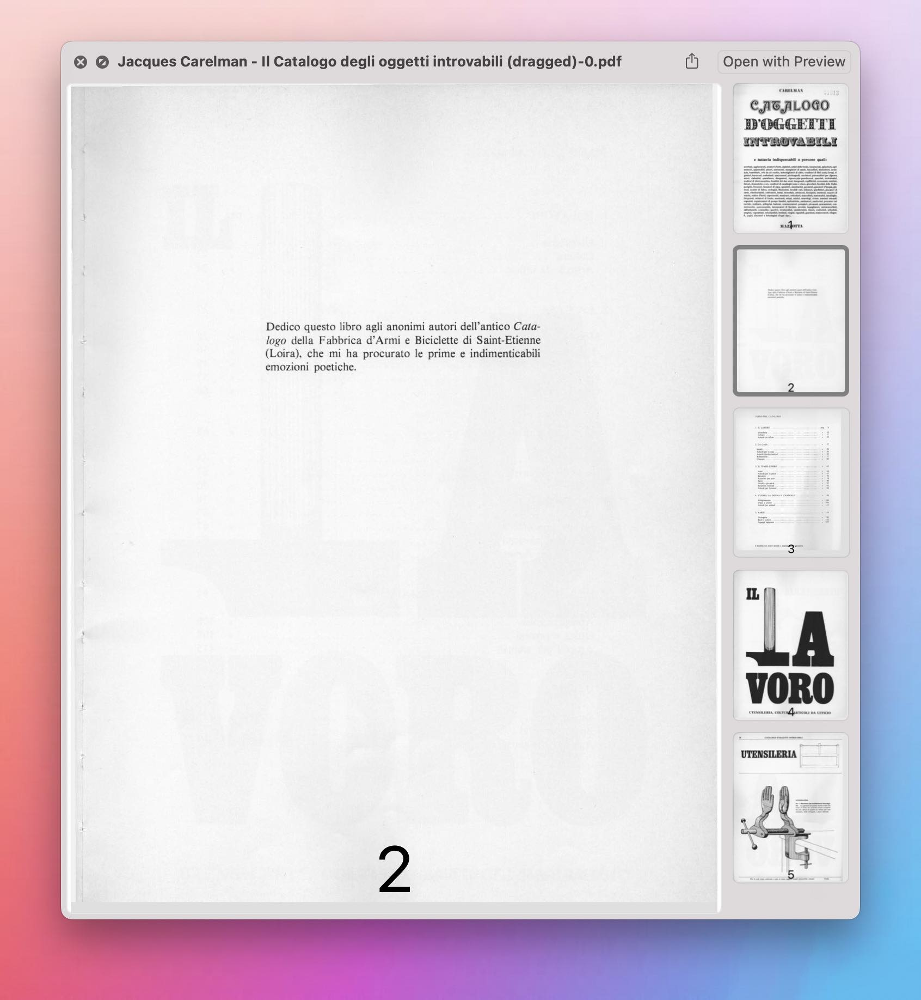

# PDF Paginate (image) PDF 添加页码

为 PDF 添加页码，可自行修改页码位置和字体大小。由于 Shortcuts 不能保留 PDF 中的文本，建议用于图片格式 PDF。

- 下载：[Shortcuts 动作](https://www.icloud.com/shortcuts/50408cfd76bd423fa5bbc4b80266e6e7)
- 出处：[UNTAG 会员栏目第十八期](https://utgd.net/article/20114)

