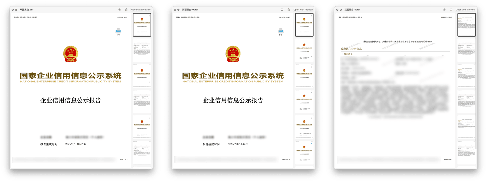

# PDF 手动双面打印

将 PDF 拆分为两份，方便手动双面打印，用于没有自动双面打印功能的打印机。打印完第一份后，将纸张收拢，翻面倒立插入打印机，再打印第二份。根据原 PDF 页数，会适当插入空白页，以免打印错位。

事出有因。我备有一台[廉价打印机](https://utgd.net/article/21042/)，需在手机端 App 内操作手动双面打印，不符合我以电脑为主的工作习惯，故另行设计一个在电脑端使用的手动双面打印方案。

Shortcuts 虽有打印模块，但鉴于 Shortcuts 本身并不稳定，如果 PDF 页数较多、体积较大或元素复杂，很容易运行失败，浪费纸张，故不推荐在 Shortcuts 中完成打印。

[Shortcuts 示例动作下载](https://www.icloud.com/shortcuts/75c3b1fa735e48d19e8fe146d3842aeb)

出处：《为打印机添加手动双面模式》，发布时间未定。

