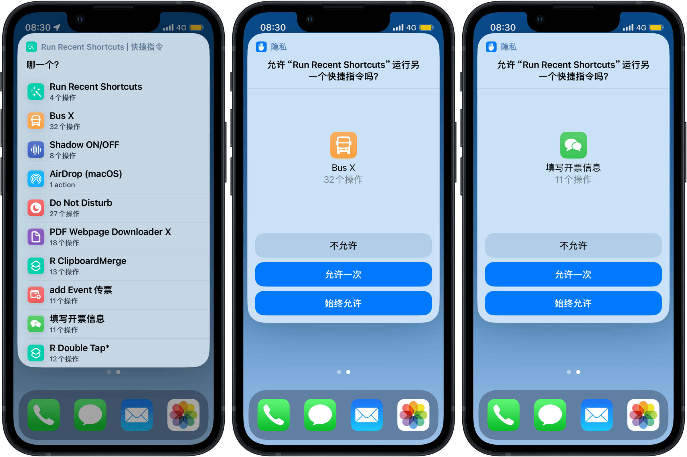

# Recently Run 汇集最近运行过的动作

汇集最近运行过的动作，以便快速取用。可自行调整过滤条件，调整过滤结果之宽严。

出处：[《如何快速呼出最近使用过的 Shortcuts 动作》](https://utgd.net/course/20491/lesson/20498)，本篇为付费内容。

下载：[Shortcuts 动作](https://www.icloud.com/shortcuts/1e289339022449f0a70f224417fb7387)。

