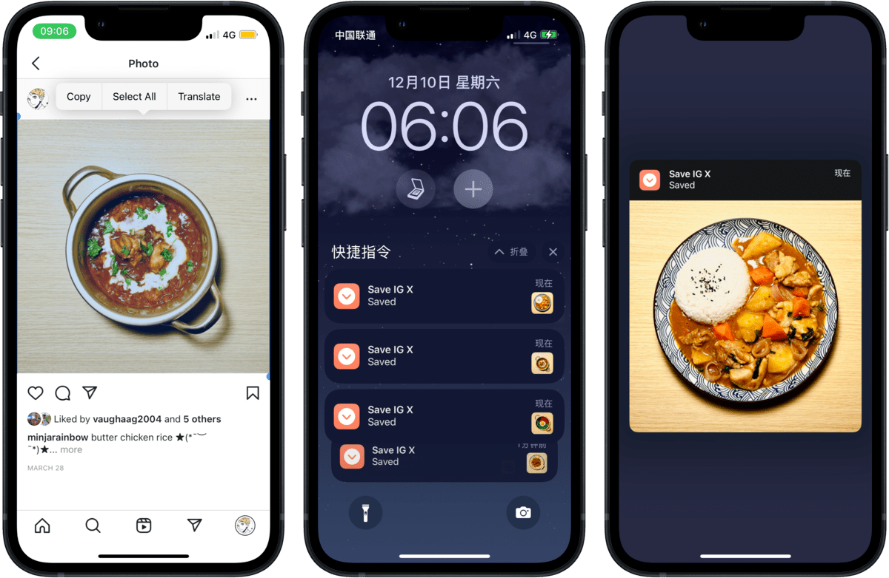

# Save Instagram X: Instagram Images Downloader

用于下载 Instagram 图片。直接在 Instagram 网页或 PWA 中长按复制图片，运行 Shortcuts 即可下载。已知的问题：

1. 我没用过 App，由于要长按复制，估计 App 用不了这个方法；
2. 复制一张下载一张，不能批量下载一个贴子里的全部图片，1.x 版本可以批量下载，但我不想为此频繁适配 API，不会再更新了，您可以在迭代记录中下载旧版本自行研究；
3. 没考虑过视频下载需求。我从来不看视频，不必提相关 issue \:-P

迭代记录：

- [v1.0](https://www.icloud.com/shortcuts/efa7beb78148464e88b6749dd7a2a9cf)
- [v1.1](https://www.icloud.com/shortcuts/d180fb5cbcf64e1e8f5f81aa24178d74)：支持多张图片下载，可以选取所需的图片。
- [v1.2](https://www.icloud.com/shortcuts/2a5ad06ddde94216951e52992cd431fa)：适配新 API，此版本会出现重复图片。
- [v2.0](https://www.icloud.com/shortcuts/4b9868451b144fd5962c1faac87832b2)：为避免频繁更新，放弃使用 API。
- [v2.1](https://www.icloud.com/shortcuts/5c7136004e0c412ea00ea0e3f67dd702)：Instagram 不再允许长按复制图片，现需连同图片前后的文字一起选中，方可运行本动作。

