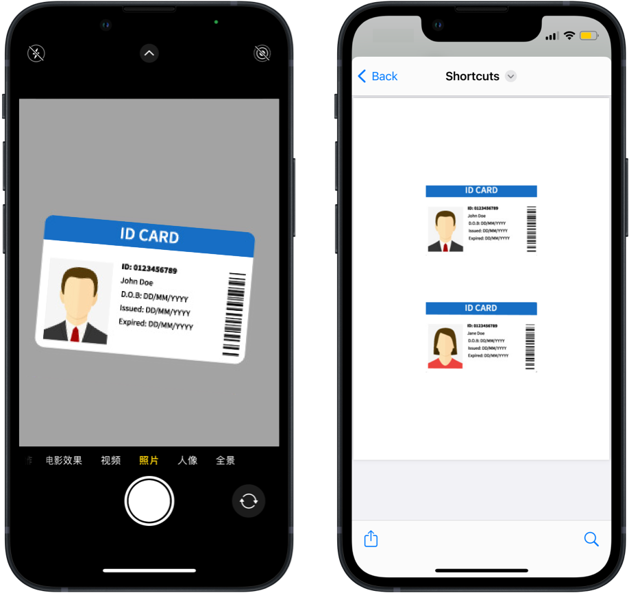

# Scan ID Card 扫描身份证

用 Shortcuts（快捷指令）扫描身份证，生成正反面在同一页上的 PDF，轻量快速，打印便捷，隐私无忧。

出处：[《用 Shortcuts 快速扫描身份证（可直接打印）》](https://utgd.net/article/20542)，预计2024年1月末发布。

下载：[Shortcuts 动作](https://www.icloud.com/shortcuts/6efd05908d0744bbb84cbb8eaa40662f)。

