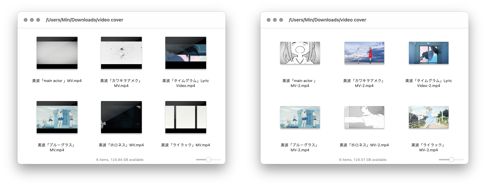

# Video Add Cover 为视频文件添加封面

借助 FFmpeg，选中视频文件和图片素材，即可将图片添加为视频文件的封面。

出处：[《如何为视频快速添加封面（附 Shortcuts 及其他动作下载）》](https://utgd.net/article/20445)。

- [Shortcuts 版下载链接](https://www.icloud.com/shortcuts/3034af08510d4afda6e3f72150c6dc45)
- [LaunchBar 版](https://github.com/BlackwinMin/LaunchBar-gallery/tree/master/Video%20Add%20Cover)

