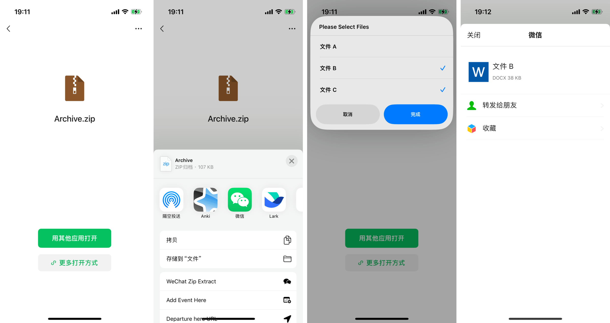

# WeChat Zip Extract 微信文件解压

即时解压微信聊天中的文件，并从中选择需转发的内容，随后批量转发（半自动，参阅[《用 Shortcuts 批量发送文件到微信，兼谈“神奇”的微信自动化》](https://utgd.net/article/20417)）。

出处：[《用 Shortcuts 即时解压 ZIP 文件并批量转发》](https://utgd.net/article/20897/)。

下载：[Shortcuts 动作](https://www.icloud.com/shortcuts/bdb81f1f993046bd8c293423ac3f6cfe)。

