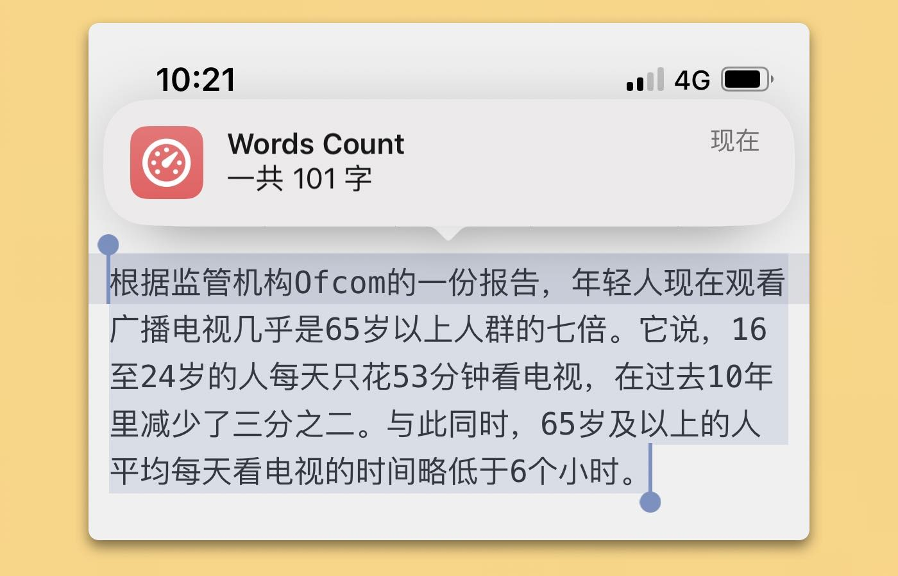

# 通用字数统计

几乎可以在任何文本编辑器中算统计字数，同时支持 iOS 和 macOS。选中文本，运行动作，查看结果，没有废话。

[Shortcuts 动作下载](https://www.icloud.com/shortcuts/3db33550d1a0436f81f482f00fa9532f)

出处：[《iOS&macOS 通用字数统计方案（Shortcuts） - #Untag》](https://utgd.net/article/9439)。

