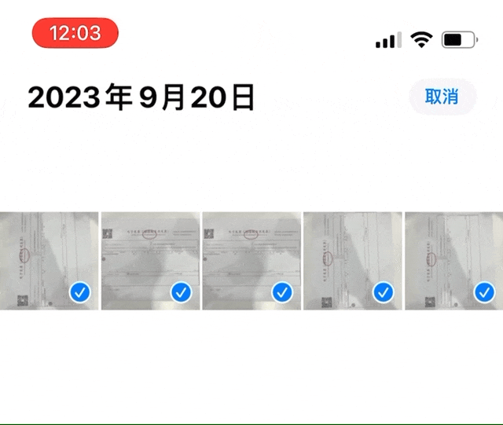

# image Auto Rotate

拍照时，我们很容易忽略取景器的状态，导致拍出来的照片有的横、有的竖。本动作可自动将竖过来的照片转回去，而原本就是横向的照片则不受影响。除了方向，图片的其他主要属性都不会发生变动，例如原始日期也得以保留。

出处：[如何用 Shortcuts 将横七竖八的照片一键统一方向](https://utgd.net/article/20481/)。

下载：[Shortcuts 动作](https://www.icloud.com/shortcuts/70dcfc0346244ef88d3c54ea3d294532)。

