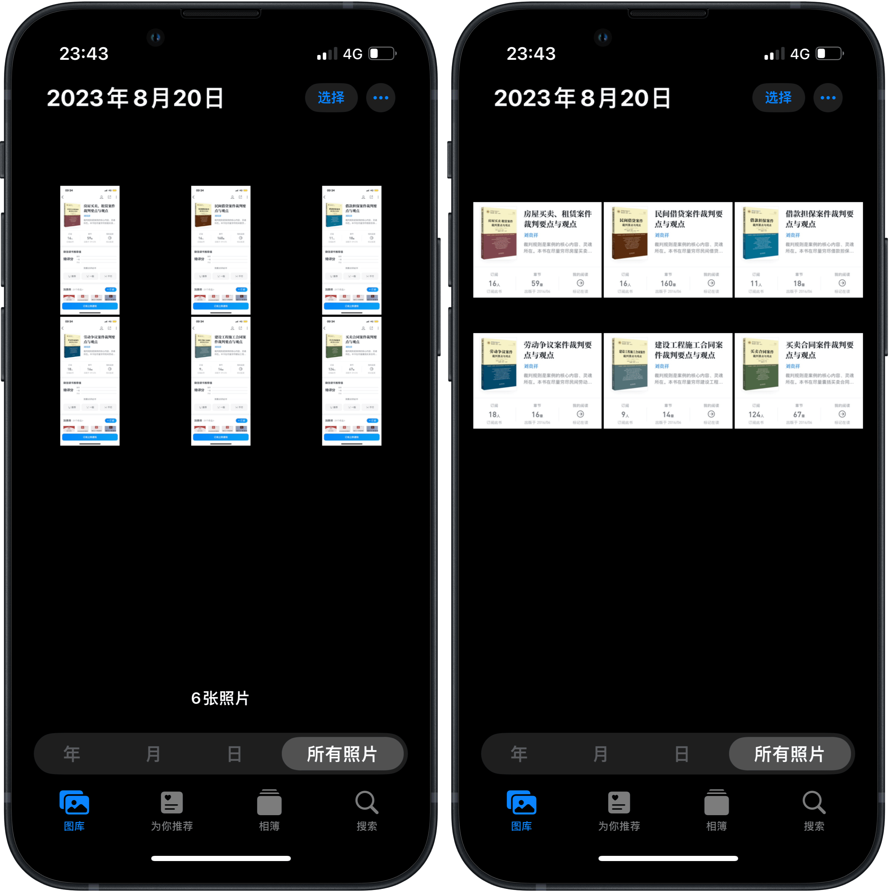

# image Crop 批量裁剪图片

只需裁剪一次，即可将裁剪位置和区域大小套用到所有目标图片，批量操作：

1. 在 Shortcuts App 内部运行本文动作；
2. 选择需要处理的图片，请确保尺寸一致，且目标区域也处于统一位置（例如，均为淘宝商品页面的图片部分，或者微信读书籍信息介绍区域）；
3. 此时将自动跳到相册，并在相册末尾放置一张供裁剪的样张，稍后操作均围绕此图；
4. 根据 Shortcuts 提示，裁掉样左侧不需要的部分并保存，然后手动切回 Shortcuts；
5. Shortcuts 自动处理宽度数据，并自动跳回 Photos；
6. 根据 Shortcuts 提示，裁掉样张上方不需要的部分并保存，然后手动切回 Shortcuts；
7. Shortcuts 自动处理高度数据，并自动跳回 Photos；
8. 根据 Shortcuts 提示，完成裁剪并保存，然后手动切回 Shortcuts；
9. Shortcuts 自动处理目标图片尺寸数据，并自动结合方才获取的长和宽，统一裁剪所有最初选中的图片。

- [Shortcuts 动作](https://www.icloud.com/shortcuts/9893013da8b64643aaef03c060316e5e)
- 原文：[《如何用 Shortcuts 批量裁剪图片》（发布时间未定）](https://utgd.net/article/20241)。

