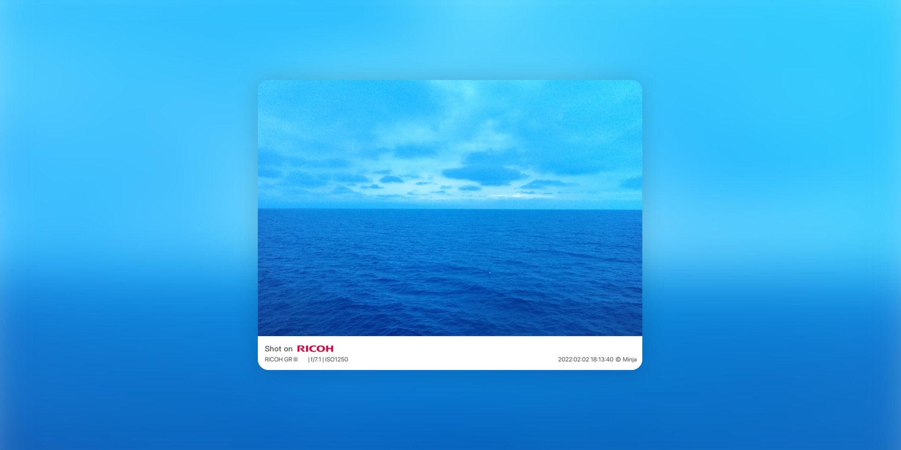

# photo Watermark Exif 照片水印

[Shortcuts 动作下载](https://www.icloud.com/shortcuts/b8d298cdde3e47499494574d0b5b7d98)

给照片加水印，目的不外乎几种，或防盗防窃防误用，例如打上“某某版权所有”或“仅用于某某活动”；或追求美观；或与摄影同好分享拍摄参数，以互通有无。本方案兼顾后两者，包括以下水印信息：

1. `Shot On + 相机品牌`，品牌信息预先设置了模板，可以展示商标，而非单纯的本文；
2. `机型 | 光圈 | 感光`，列出主要参数，这里只是举例，故非常精简，您可以参照原文内容添加更多信息；
3. `日期 + 版权信息`，使用前请将 `© Minja` 更改为您自己的权利信息，如果名字较长，可能需要参考原文内容微调这一部分信息的摆放位置。

出处：[《给照片添加“徕卡风格水印”，兼谈 Shortcuts 中的字典》](https://utgd.net/)（预计2023年5月中旬发布）。

