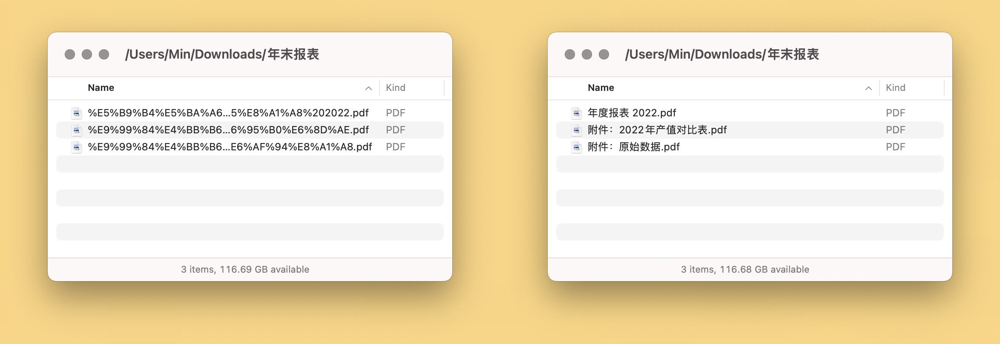

# 修复文件名乱码

下载文件或打开压缩包后，时常遇到 %E4%B9%B1%E7%A0%81 形式的文件名乱码。本文提供一个 Shortcuts（快捷指令）解决方案，无需代码知识即可批量修复这类文件名。

下载：[Shortcuts 动作](https://www.icloud.com/shortcuts/92a0646cd24b4ffdb43cb88c5f2ec599)

出处：[《用 Shortcuts 批量修复 %E4%B9%B1 类型的文件名乱码》](https://utgd.net/article/9927)。

