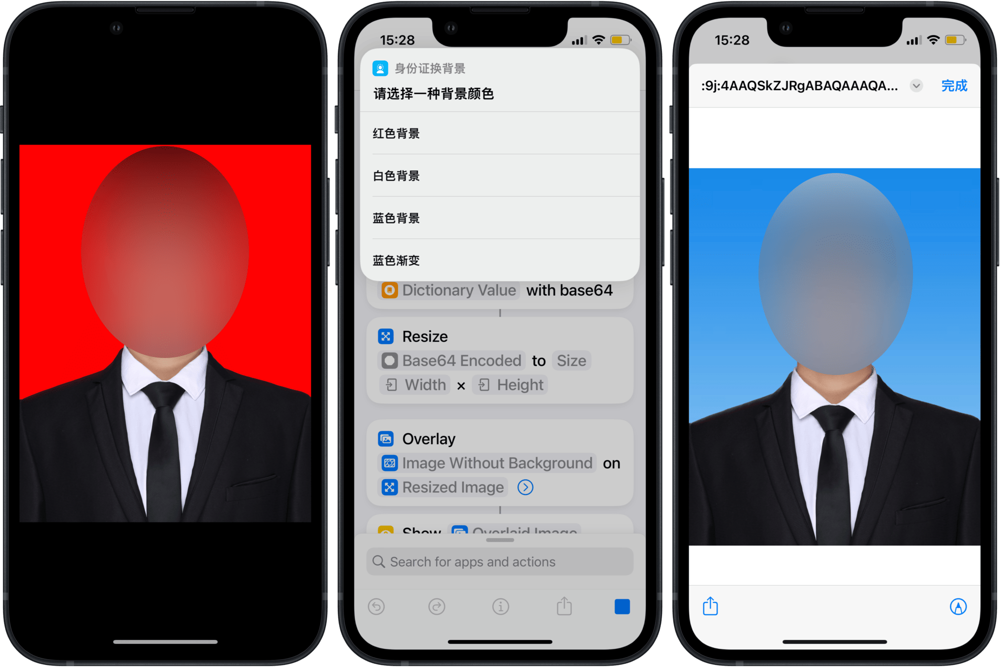

# 证件照换背景

借助 iOS 设备的机器学习功能，无需第三方软件即可更换证件照背景，方便、免费且保护隐私。同时，配合各个 Shortcuts 模块，还可以轻松自定义各种背景，从纯色、渐变色到不同纹理的织物皆可。

- [Shortcuts 动作](https://www.icloud.com/shortcuts/3316df0ffeda468a9bcae93d8b71330f)
- [20240729 更新版动作，支持自定义尺寸](https://www.icloud.com/shortcuts/3316df0ffeda468a9bcae93d8b71330f)
- 原文：[《用 Shortcuts 更换证件照背景，可自定义图片》](https://utgd.net/article/20800/)。

