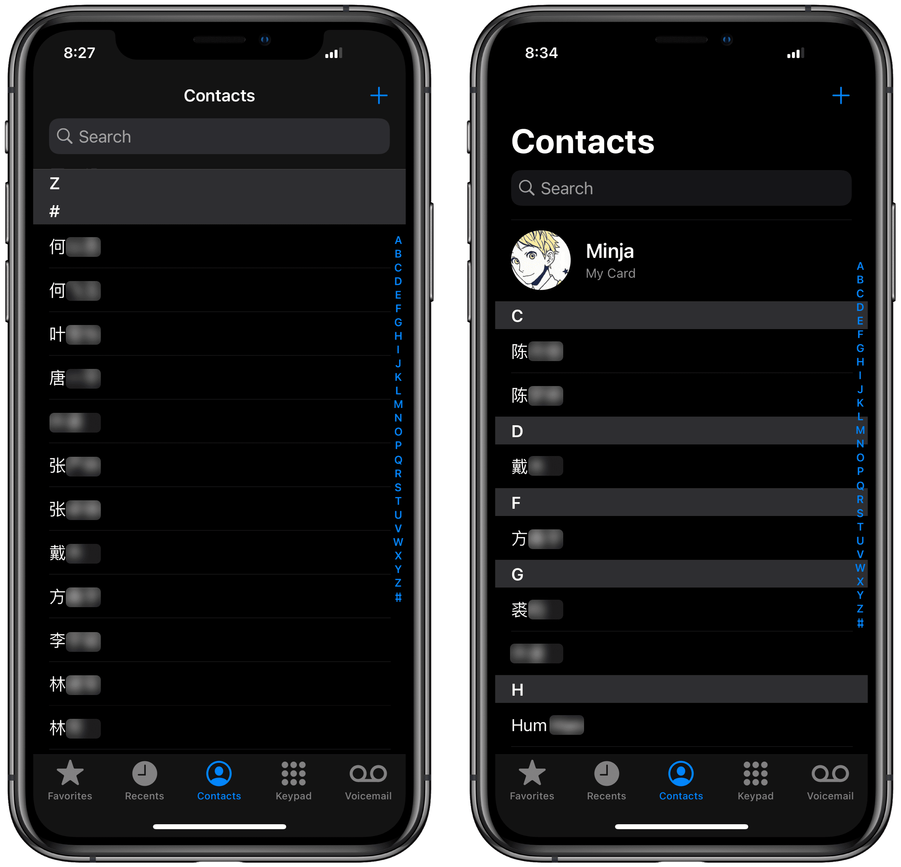

# 通讯录中文排序

[Shortcuts 动作下载](https://www.icloud.com/shortcuts/9cb1ff364cb84d5d8f804b228b72ef98)

英文及其他外文操作系统环境下，iOS 通讯录中的中文联系人无法按拼音排序，不便查找。其实无需逐个修改，也不必牺牲隐私乞援第三方软件，用 Shortcuts（快捷指令）就能批量调整。

出处：[《让 iPhone 通讯录中的中文联系人按拼音顺序显示（Shortcuts）》](https://utgd.net/article/20111)（2023年4月上旬发布）。

